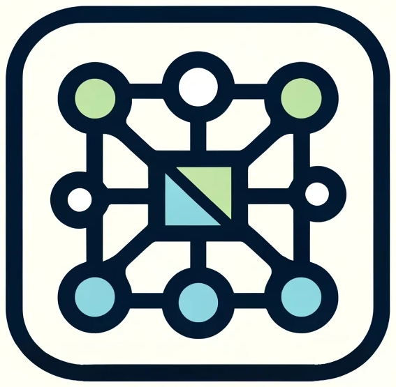

<a name="readme-top"></a>
[](https://pypi.org/project/humid/)
[](https://pepy.tech/project/humid)

[](https://pdm-project.org/en/latest/)
[](https://pre-commit.com/)
[](https://github.com/astral-sh/ruff)
[](https://squidfunk.github.io/mkdocs-material/)

<!-- PROJECT LOGO -->

<br />
<div align="center">
    <div align="center">
    <!--  -->
    
    </div>
  <!-- <h3 align="center">humid</h3> -->

  <p align="center">
    Networkx Graphs synced across devices using Zenoh.
    <br />
    <!-- <a href="https://h0uter.github.io/humid"><strong>Explore the docs »</strong></a> -->
    <br />
    <br />
    <a href="https://github.com/h0uter/networkedx/issues/new?labels=bug&title=New+bug+report">Report Bug</a>
    ·
    <a href="https://github.com/h0uter/networkedx/issues/new?labels=enhancement&title=New+feature+request">Request Feature</a>
  </p>
</div>

<!-- # networkedx -->

## Quickstart

- run  `zenohd -c .zenoh_docker/zenoh-myhome.json5` to create a storage
- or `docker compose up zenoh-host` to create a storage.

then run the following `pip install -e .` to install the package.

Then run an example with `python examples/main.py`

## Why?

- If you model your application domain as a graph, this package makes it easy to run on multiple devices and automatically sync the graph between them.
- It is an abstraction on top of the Zenoh protocol, which is a very efficient protocol for IoT applications.
- It is a drop-in replacement for networkx, so you can use all the networkx methods on the graph.

## How?

- The graph is stored in a zenoh storage, which is a key-value store.
- The nodes and edges are stored as keys in the zenoh storage.
- The graph is synced between devices using zenoh Storages. This protocol automagically orchestrates allignment between storages, even if the network becomes partitioned and then later reconnects.

## Example

Assuming:

- you have two devices, and you want to create a graph on one device and access it on the other device.
- you have a zenoh storage running on both devices.
- Both devices can find each other using zenoh discovery (local network or using a Zenoh Router).

On device one:

```python
import networkedx as znx

G = znx.Graph()
G.add_node(1, data="data")
G.add_edge(1, 2, data="data")

```

After that on device two:

```python
import networkedx as znx

G = znx.Graph()
print(G.nodes(data=True))
>>> [(1, {'data': 'data'}), (2, {})]

print(G.edges(data=True))
>>> [(1, 2, {'data': 'data'})]
```
