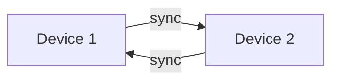

# Two devices example

Here we show

- That two dockers with a storage each on separate networks can sync their graph if they lose connection.

## How to run
- [ ] ssh into machine 2 from 1
- [ ] docker compose up on both machines
- [ ] disable network on machine 2
- [ ] add nodes on machine 1
- [ ] reenable network on machine 2
- [ ] see the sync occur

## Steps

- [x] create viz of graph
- [ ] make endpoint configurable
- [ ] make port configurable, can also do at docker compose level
