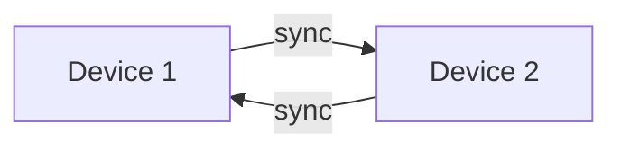

# Two devices example

Here we show

- That two dockers with a storage each on separate networks can sync their graph if they lose connection.

## How to run

- [ ] docker compose up
- [ ] click play
- [ ] disable and reenable network
- [ ] see the sync occur

## Steps

- [ ] create compose file with sep networks
- [ ] create viz of graph
